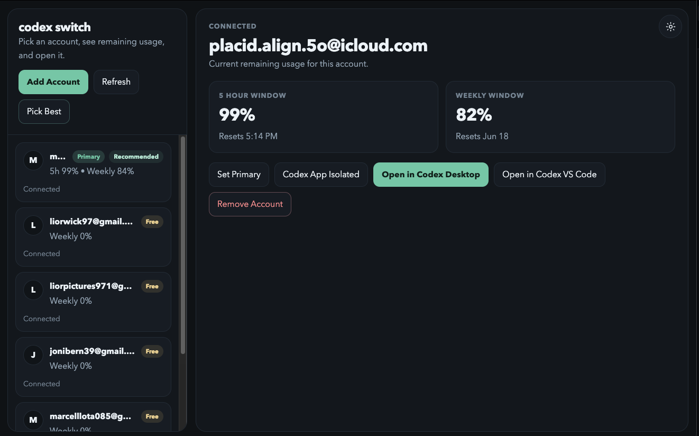

# Codex Switch

Codex Switch is a small desktop app for managing multiple isolated Codex accounts from one place. It shows account status, remaining usage windows, and lets you open the selected account in Codex Desktop, an isolated Codex app profile, or Codex VS Code.



## Highlights

- Switch between prepared Codex account homes under `~/llm_accounts_profiles/codex/profiles`.
- See live usage windows when account data is available.
- Add local accounts through the normal ChatGPT/Codex sign-in flow.
- Set a primary account by copying the selected `.codex/auth.json` into the main Codex home.
- Open accounts in isolated Codex Desktop profiles without closing your current Codex session.
- Open the selected account in Codex VS Code.
- Run without a Codex Switch license key, activation server, or startup login gate.

## How It Works

Codex Switch is built from three pieces:

- Electron shell: starts the local backend, hosts the desktop window, and manages updater actions.
- Python backend: discovers accounts, prepares profile homes, launches Codex, and serves the local API.
- React frontend: renders the account dashboard, usage cards, sign-in state, diagnostics, and update controls.

The app stores its own metadata in `~/codex_switch_data` and keeps account profiles in `~/llm_accounts_profiles/codex/profiles`. It does not copy browser cookies, local storage, or Keychain items.

## Requirements

- Node.js and npm
- Python 3
- Codex Desktop or a compatible Codex CLI install
- PyInstaller, only when building packaged desktop apps

## Quick Start

```bash
git clone https://github.com/liorhad97/codex_switch.git
cd codex_switch
npm install
npm run electron
```

For backend-only development:

```bash
python3 main.py
```

## Development

Run the local backend against the built web UI:

```bash
npm run web:build
npm run backend
```

Run tests:

```bash
python3 -m unittest discover -s tests -v
npm run web:build
```

## Packaging

Install packaging dependencies once:

```bash
npm install
python3 -m pip install pyinstaller
```

Build installers:

```bash
npm run dist:mac
npm run dist:win
npm run dist:linux
```

Windows backend packaging should be done on Windows. If PyInstaller is installed under a specific Python version, pass it explicitly:

```bash
PYTHON=python3.12 npm run dist:mac
```

## GitHub Actions

The repository includes a workflow that builds macOS, Windows, and Linux installers and uploads them as GitHub Actions artifacts. No external publishing accounts or platform signing secrets are required.

## Project Layout

```text
codex_profile_switcher/  Python backend and account/profile logic
electron/                Electron main process, preload bridge, and assets
web/src/                 React frontend
scripts/                 Build, publishing, and smoke-test helpers
tests/                   Python unit tests
docs/assets/             README and documentation images
```

## Privacy Notes

Codex Switch works with local account profile folders and Codex auth files. It does not bypass Codex authentication, collect account credentials, or transfer browser session data. Each new account still signs in through the regular ChatGPT/Codex flow.

## Disclaimer

Codex Switch is provided for research, educational, and personal productivity purposes. It is not affiliated with OpenAI, ChatGPT, Codex, Apple, Microsoft, GitHub, or any other service provider mentioned in this repository.

Use this software at your own risk. The maintainers and contributors are not responsible for account issues, lost data, rate-limit changes, service interruptions, security incidents, policy violations, or any other damages or losses that may result from using, modifying, building, or distributing this project.

Users are solely responsible for complying with all applicable laws, platform terms, account policies, workplace rules, and third-party rights. Do not use this project to bypass access controls, impersonate another person, abuse services, scrape data without permission, or violate any terms of service.

The software is provided "as is", without warranties of any kind. This disclaimer is not legal advice; consult a qualified legal professional for questions about licensing, compliance, or liability.

## Open Source

Codex Switch has no commercial activation key or paid license gate. Add a `LICENSE` file when you are ready to declare the project’s open-source license terms.
